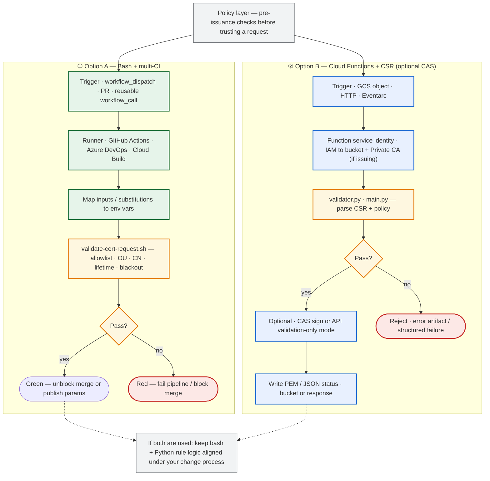

# GCP Certificate Policy Validator

**Repository:** `gcp-cert-policy-validator`

**Pre-issuance policy checks** for client certificate **request parameters** (and optional **serverless** CSR handling). No Terraform ships here.

This repo supports **two parallel deployment styles** for the same policy rule set:

| Option | What | Terraform in repo |
|--------|------|-------------------|
| **A — Bash + CI** (default) | **`scripts/validate-cert-request.sh`** on GitHub Actions, ADO, Cloud Build. No CAS calls; **no GCP credentials** on the runner. | None |
| **B — Serverless** | **`function/`** Python for **Google Cloud Functions** (GCS-triggered style): validate CSR, optionally call **CAS** for issue/validation-mode. **[Details →](docs/serverless-option.md)** | None — you deploy how you like |

Use **A** for **PR gates** and rule design; use **B** for **event-driven** CSR handling in GCP.

---

### End-to-end automation (both deployment styles)

Same **policy goals**; pick **Option A**, **Option B**, or **both** (keep rule logic aligned). Option A never calls Google APIs from the validation step; Option B runs inside GCP with a **service identity** and optional **CAS**. Details: [`docs/pipeline.md`](docs/pipeline.md) (CI), [`docs/serverless-option.md`](docs/serverless-option.md) (Functions).



---

## Setup and use (Option A — start here)

**Step-by-step:** **[docs/setup-and-use.md](docs/setup-and-use.md)** — local shell, GitHub Actions, Azure DevOps, and Cloud Build.

**Option B (serverless):** **[docs/serverless-option.md](docs/serverless-option.md)**.

**One-minute local check:**

```bash
cd scripts
export WORKLOAD_ENV=dev WORKLOAD_APP=sample-app \
  COMMON_NAME=api-dev.example.internal ORGANIZATIONAL_UNIT=dev-sample-app \
  VALIDITY_DAYS=400 MIN_VALIDITY_DAYS=365 MAX_VALIDITY_DAYS=730 MAX_VALIDITY_DAYS_PROD=548 \
  MAINT_WINDOW_START_MONTH=11 MAINT_WINDOW_END_MONTH=1 MAINT_WINDOW_END_DAY=7 \
  ALLOWED_APPS=sample-app,sample-service STRICT_VALIDITY_ENVS=prod
chmod +x validate-cert-request.sh
./validate-cert-request.sh
```

Use **Linux** or **WSL** for GNU `date -d`. Native macOS `date` may fail the maintenance-window checks.

---

## What this solution delivers

| Pillar | What you get |
|--------|----------------|
| **Policy-as-code** | **`scripts/validate-cert-request.sh`**: app allow-list, **OU = `<env>-<app>`**, **CN** env token + length/charset, lifetime min/max, **`STRICT_VALIDITY_ENVS`**, maintenance / blackout window on derived `notAfter`. |
| **No cloud in Option A path** | Validation is **bash** (+ GNU `date` on Linux). **No** `gcloud`, **no** service account, **no** billable API calls for that step. |
| **Familiar CI layout** | **Azure DevOps**, **GitHub Actions** (**reusable** workflow), and **Cloud Build** for Option A. |
| **Documentation** | Diagram gallery, pipeline reference, validation deep-dive, **deployment options** (bash vs serverless). |

---

## Repository layout

| Path | Role |
|------|------|
| `scripts/validate-cert-request.sh` | **Option A:** policy engine (env-driven, CI). |
| `function/` | **Option B:** Cloud Functions–oriented Python (CSR + optional CAS). See **`function/examples/README.md`** for local CSR generation (no fixtures committed). |
| `cicd/` | Azure DevOps caller + template (**validate** only, Option A). |
| `.github/workflows/` | Manual + **reusable** validate workflows (**no secrets**, Option A). |
| `cloudbuild/` | Cloud Build **substitution**-driven validate step (Option A). |
| `docs/` | Architecture, diagrams, pipeline, validation matrix, setup, serverless option. |
| `.gitignore` | Local / IDE noise; keys ignored. |

**Intentionally no `terraform/`** — bring your own PKI automation if Option B issues certificates.

---

## Documentation

| Document | Contents |
|----------|-----------|
| **[docs/setup-and-use.md](docs/setup-and-use.md)** | **Option A:** install, local run, GitHub, ADO, Cloud Build. |
| **[docs/serverless-option.md](docs/serverless-option.md)** | **Option B:** Cloud Functions path vs bash; no Terraform here. |
| [docs/diagrams.md](docs/diagrams.md) | **Diagram gallery** (README also has **end-to-end automation** above). |
| [docs/architecture.md](docs/architecture.md) | Positioning and validation context. |
| [docs/validation-deep-dive.md](docs/validation-deep-dive.md) | **Rule matrix** and decision flow. |
| [docs/pipeline.md](docs/pipeline.md) | ADO / GitHub / Cloud Build (Option A). |
| [docs/solution-compare.md](docs/solution-compare.md) | **Option A vs Option B** in this repo. |

---

## Scope

**Option A** is **pre-issuance parameter validation** in CI **without** CAS. **Option B** can **call CAS** from GCP for issuance-style flows but does **not** by itself implement broad **PKI**, **trust-config allowlists**, **revocation workflows**, or **backup** automation—those are separate concerns for your platform to design.
