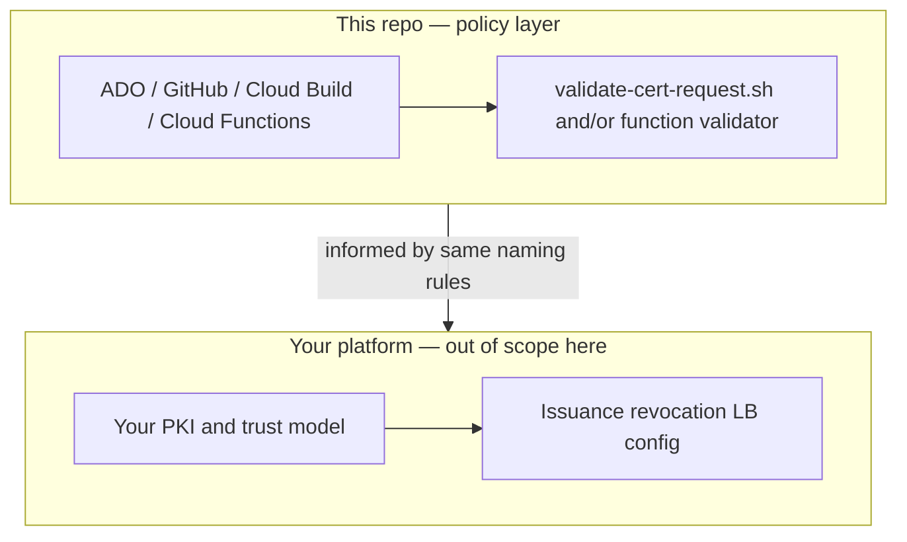

# Architecture — GCP Certificate Policy Validator

**GCP Certificate Policy Validator** focuses on **policy checks** for certificate **request parameters** (Option A) and optional **CSR + CAS** flows (Option B), without prescribing how you operate a full PKI program.

---

## Position in a larger program

---

## Runtime dependencies

| Dependency | Notes |
|------------|--------|
| **Bash** | Option A: `set -euo pipefail` policy script. |
| **GNU date** | Option A: `-d` for projected `notAfter` and blackout check. |
| **Python + libs** | Option B: see `function/requirements.txt`. |

---

## Where rules live

- **Option A:** **`scripts/validate-cert-request.sh`**. Environment variables are the **contract** with ADO, GitHub, and Cloud Build configs in this repo.
- **Option B:** **`function/validator.py`** and handlers in **`function/main.py`** (align behavior with Option A when both are used).

---

Return to [README](../README.md) · [diagrams.md](diagrams.md)
