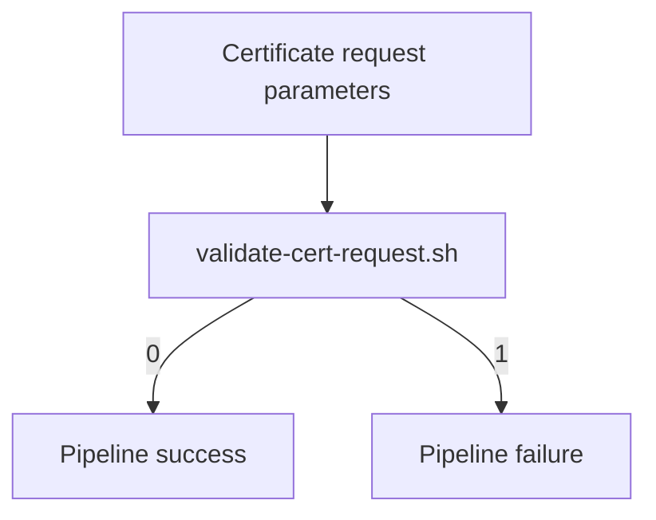
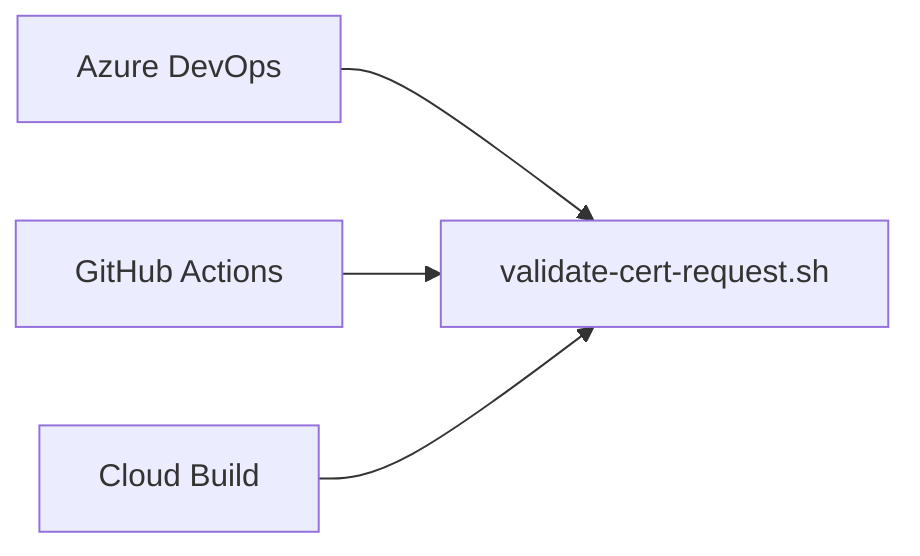
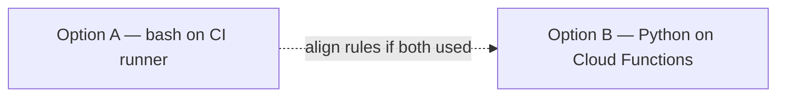
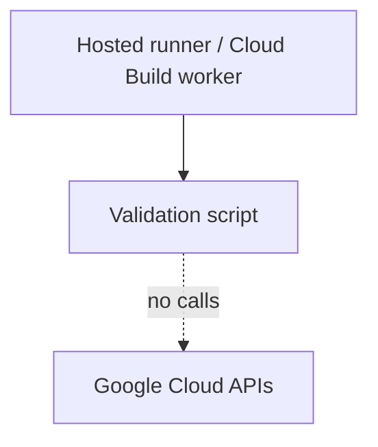
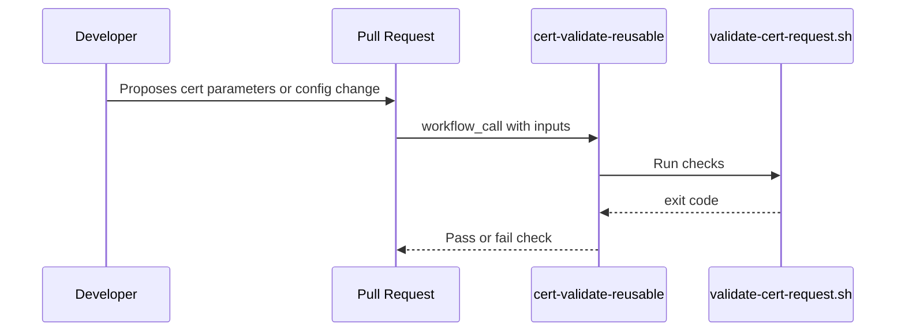

# Diagram gallery — GCP Certificate Policy Validator

---

## 1. Scope (validation only)

---

## 2. CI parity (three surfaces)

---

## 3. Option A and Option B (same repo)

---

## 4. No-credentials boundary

---

## 5. Merge request gate (typical use)

---

Return to [README](../README.md)
