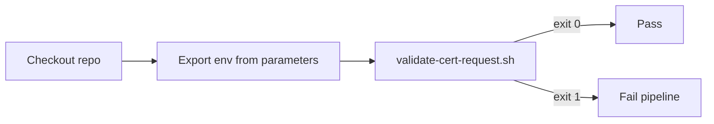

# Pipeline automation

This solution runs **one stage**: **pre-issuance validation**. **No secrets**, **no GCP auth**.

---

## Stage flow



---

## Files

| File | Role |
|------|------|
| `cicd/cert-validate-workflow.yaml` | ADO caller + parameters. |
| `cicd/templates/cert-validate-template.yaml` | ADO job running the script. |
| `.github/workflows/cert-validate.yaml` | `workflow_dispatch` → reusable. |
| `.github/workflows/cert-validate-reusable.yaml` | **`workflow_call`** for PR checks / other workflows. |
| `cloudbuild/cert-validate.yaml` | Substitutions → bash + script. |

---

## Reusing the GitHub workflow elsewhere

```yaml
jobs:
  policy:
    uses: ./.github/workflows/cert-validate-reusable.yaml
    with:
      workload_app: ${{ vars.APP }}
      workload_env: ${{ vars.ENV }}
      # ... match all required string inputs
```

No `secrets:` block required.

---

## Parameter mapping

Environment variable names match the **contract** expected by **`scripts/validate-cert-request.sh`** — reuse the same names across your pipelines so validate stays portable.

Return to [README](../README.md)
