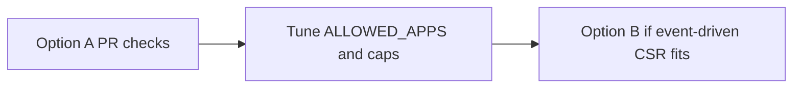

# Deployment options in this repository

**Option A** (bash + CI) vs **Option B** (`function/` serverless). More on Option B: **[serverless-option.md](serverless-option.md)**.

---

## Feature comparison

| Capability | Option A — `scripts/` + CI | Option B — `function/` |
|------------|---------------------------|------------------------|
| Pre-issuance validation | ✅ `validate-cert-request.sh` env contract | ✅ Python `validator.py` + CSR |
| CAS / Private CA API | ❌ | ✅ Optional issue or validation-mode |
| GCP credentials on runner | ❌ Not needed | ✅ Required |
| Multi-CI (ADO / GHA / Cloud Build) | ✅ Wired in this repo | ❌ You deploy Functions / triggers |
| Terraform in this repo | ❌ | ❌ |

---

## Adoption path

---

Return to [README](../README.md)
