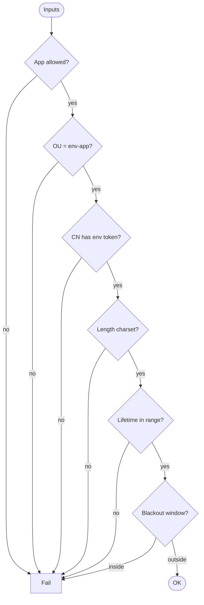

# Validation deep dive

Rules implemented in **`scripts/validate-cert-request.sh`**. If you maintain multiple copies or a serverless twin, **keep rule logic aligned** under your change process.

---

## Rule matrix

| # | Rule | Failure impact |
|---|------|----------------|
| 1 | **`WORKLOAD_APP`** ∈ comma list **`ALLOWED_APPS`** | Blocks undeclared applications. |
| 2 | **`ORGANIZATIONAL_UNIT`** == **`WORKLOAD_ENV`-`WORKLOAD_APP`** | Forces env-app naming discipline. |
| 3 | **`COMMON_NAME`** contains **`WORKLOAD_ENV`** substring | Aligns CN with target environment. |
| 4 | **`COMMON_NAME`** length ≤ 64 | RFC 5280 practical ubiquity. |
| 5 | **`ORGANIZATIONAL_UNIT`** length ≤ 64 | Same. |
| 6 | **`COMMON_NAME`** charset: alphanumeric + internal `.`/`-`, sensible ends | Reduces exotic subjects. |
| 7 | **`VALIDITY_DAYS`** ≥ **`MIN_VALIDITY_DAYS`** | Prevents ultra-short certs if policy forbids. |
| 8 | **`VALIDITY_DAYS`** ≤ **`MAX_VALIDITY_DAYS`** (or ≤ **`MAX_VALIDITY_DAYS_PROD`** if env ∈ **`STRICT_VALIDITY_ENVS`**) | Per-env lifetime caps. |
| 9 | Derived **`notAfter`** not in **maintenance window** (month/day bands) | Avoids expiries during freeze. |

---

## Decision flow

---

## Environment contract

| Variable | Example | Notes |
|----------|---------|--------|
| `WORKLOAD_ENV` | `dev` | Must match OU/CN expectations. |
| `WORKLOAD_APP` | `sample-app` | |
| `COMMON_NAME` | `api-dev.example.internal` | |
| `ORGANIZATIONAL_UNIT` | `dev-sample-app` | |
| `VALIDITY_DAYS` | `400` | |
| `ALLOWED_APPS` | `sample-app,sample-service` | |
| `STRICT_VALIDITY_ENVS` | `prod` | Comma-separated labels that use the prod cap. |

---

## GNU date

Maintenance-window logic uses `date -u -d "+N days"`. **Linux CI** is the supported path.

Return to [README](../README.md)
